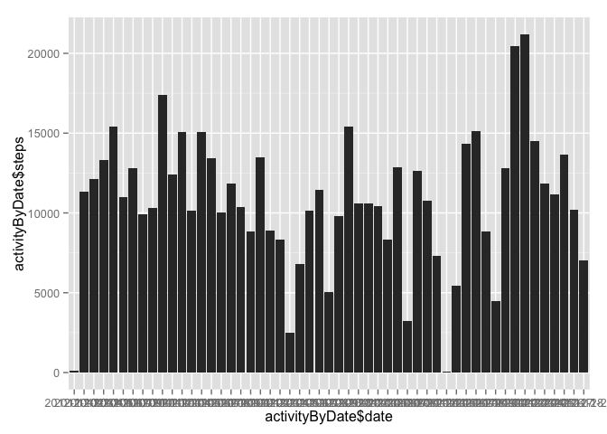
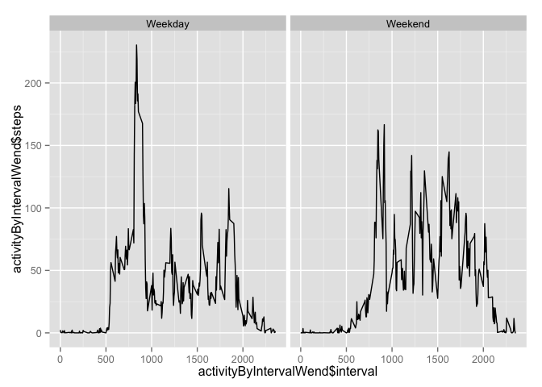

# Reproducible Research: Peer Assessment 1


## Loading and preprocessing the data

```r
library(ggplot2)
```

```
## Warning: package 'ggplot2' was built under R version 3.1.3
```

```r
unzip("activity.zip", "activity.csv")
activity <- read.table("activity.csv", sep=",", header=T)
activityNoNA <- activity[!is.na(activity$steps),]
```

## What is mean total number of steps taken per day?

```r
activityByDate <- aggregate(steps ~ date, activityNoNA, sum)
qplot(activityByDate$date, activityByDate$steps, geom="bar", stat="identity")
```

 

```r
mean(activityByDate$steps)
```

```
## [1] 10766.19
```

```r
median(activityByDate$steps)
```

```
## [1] 10765
```

## What is the average daily activity pattern?

```r
activityByInterval <- aggregate(steps ~ interval, activityNoNA, mean)
qplot(activityByInterval$interval, activityByInterval$steps, geom="bar", stat="identity")
```

 

```r
activityByInterval[which.max(activityByInterval$steps),]
```

```
##     interval    steps
## 104      835 206.1698
```

## Imputing missing values

```r
sum(is.na(activity$steps))
```

```
## [1] 2304
```

```r
activityImputed <- activity
for (i in 1:nrow(activityImputed)) {
    if (is.na(activityImputed[i, 1])) {
       activityImputed[i, 1] <- activityByInterval[activityByInterval$interval == activityImputed[i, 3], 2]
    }
}
activityByDateImputed <- aggregate(steps ~ date, activityImputed, sum)
qplot(activityByDateImputed$date, activityByDateImputed$steps, geom="bar", stat="identity")
```

 

```r
mean(activityByDateImputed$steps)
```

```
## [1] 10766.19
```

```r
median(activityByDateImputed$steps)
```

```
## [1] 10766.19
```

## Are there differences in activity patterns between weekdays and weekends?

```r
activityImputed$wend <- as.factor(ifelse(weekdays(as.Date(activityImputed$date)) %in% c("Saturday","Sunday"), "Weekend", "Weekday"))
activityByIntervalWend <- aggregate(steps ~ interval+wend, activityImputed, mean)
qplot(activityByIntervalWend$interval, activityByIntervalWend$steps, data=activityByIntervalWend, type="l", stat="identity", facets = .~wend)
```

 
